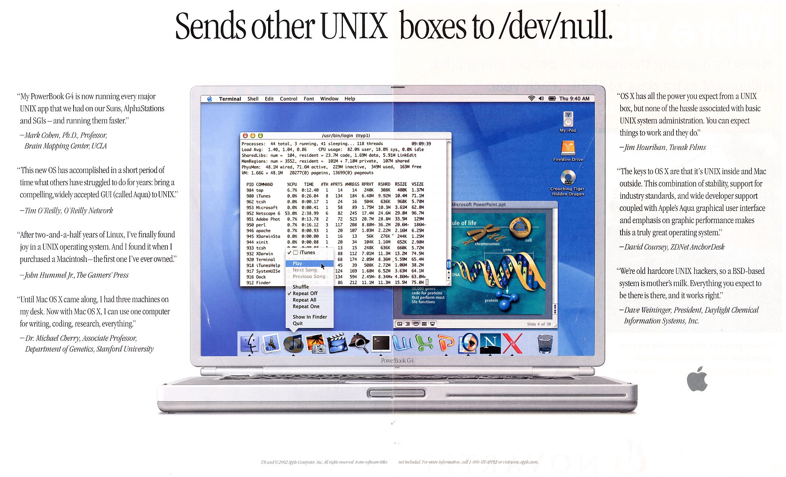
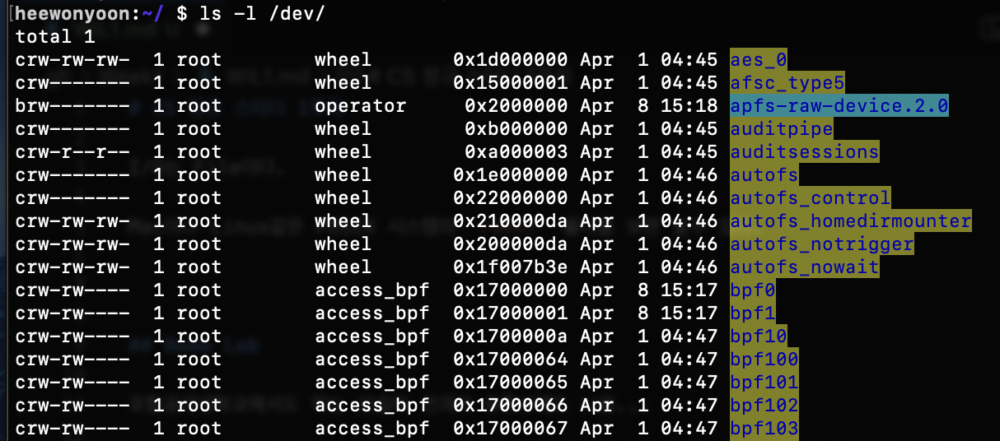
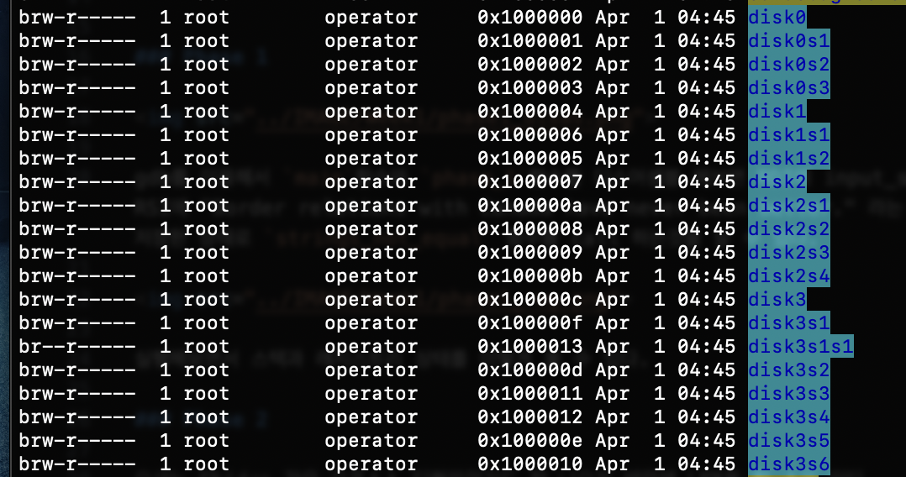
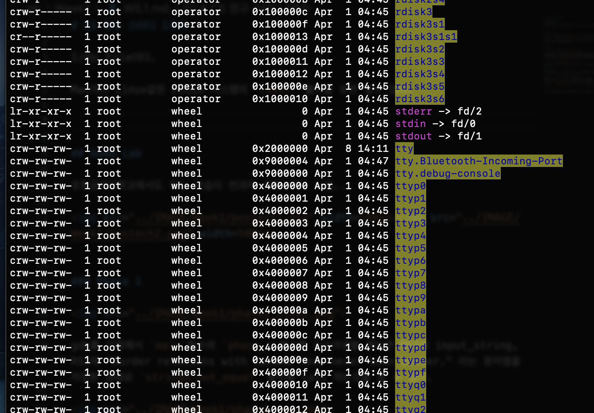
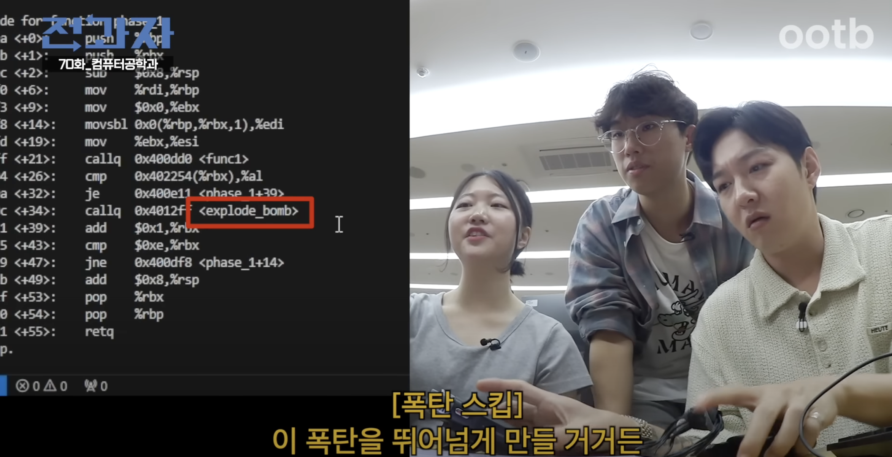
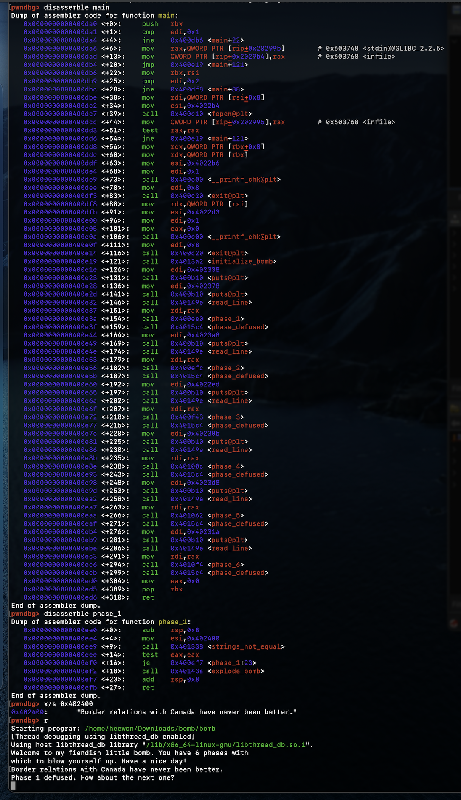
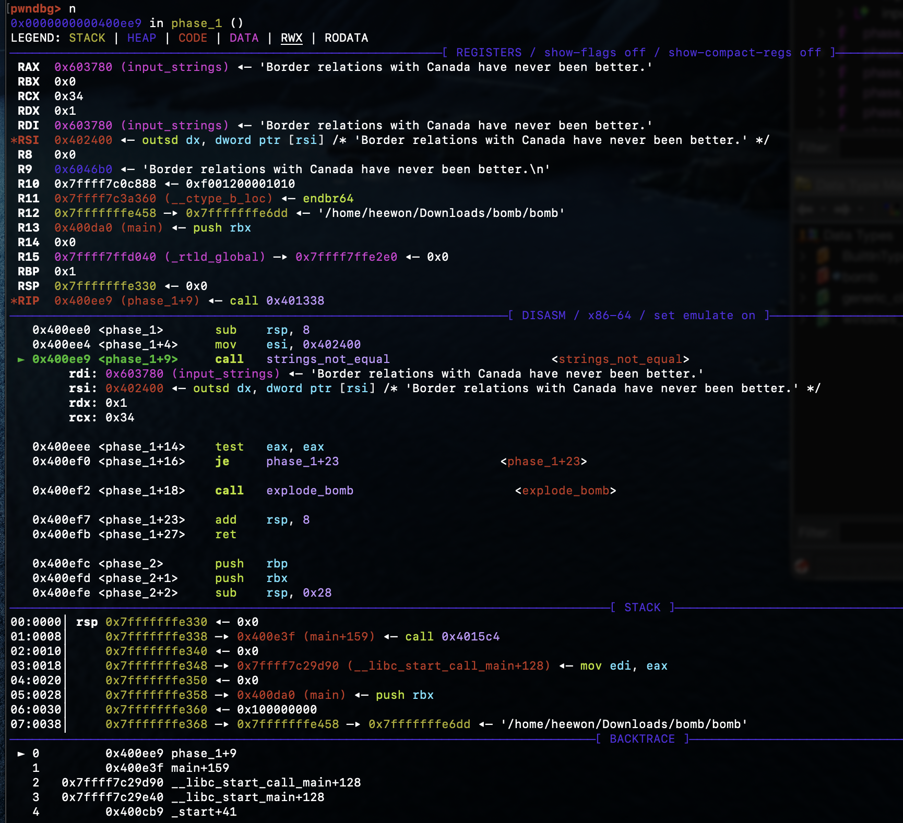
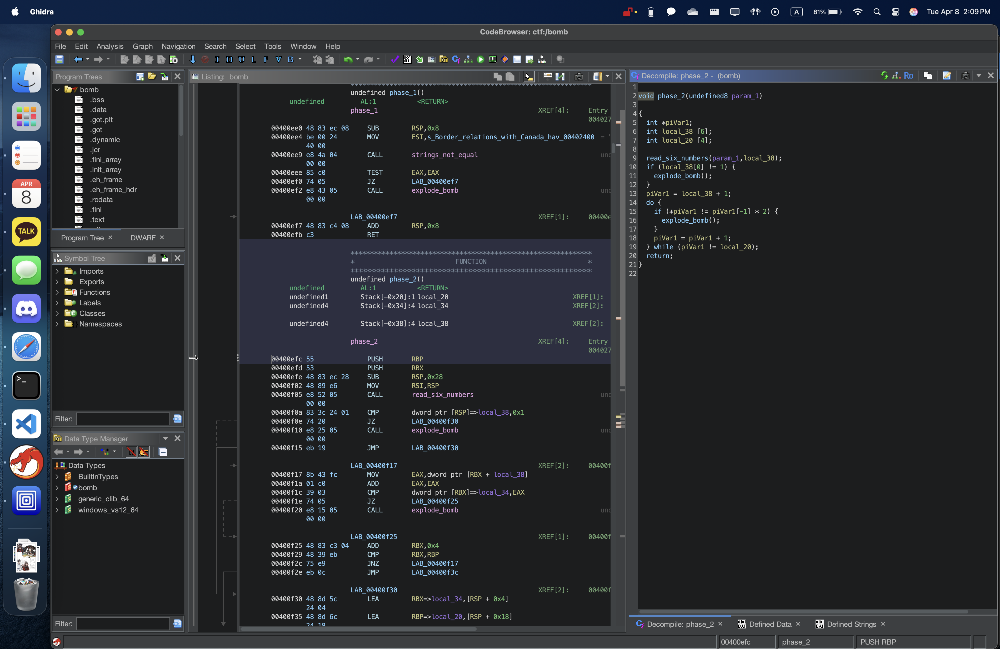
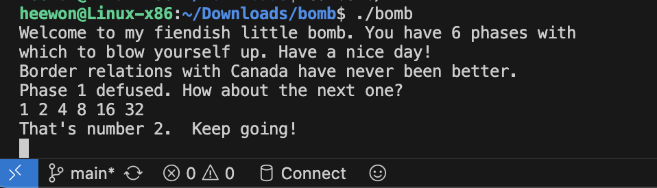

# CS 정규 스터디 1주차

## 📁 I/O는 File이다

POSIX 기반의 시스템에서는 "모든 것은 파일이다"라는 철학을 바탕으로 시스템 리소스에 접근한다. 일반적인 파일뿐만 아니라, 디바이스, 터미널, 네트워크 인터페이스 등도 파일로 표현된다.

Windows에서는 이러한 개념이 덜 명확할 수 있지만, Mac이나 Linux 시스템에서는 `/dev/` 디렉토리를 통해 이를 직접 확인할 수 있다.

나의 /dev/ 폴더이다

여기서 AES 하드웨어 가속을 위한 `aes_0`, 네트워크 관련 패킷 필터링을 담당하는 `bpf` 등의 특수 장치 파일을 확인할 수 있다.

디스크와 관련된 장치 파일들도 `/dev/`에 존재하며, 물리 디스크는 `disk`로 시작하는 이름을 가진다.

`stdin`, `stdout` 같은 표준 입출력 장치와 터미널을 나타내는 `tty` 등도 `/dev/` 아래에 존재한다. 이처럼 입출력은 모두 파일 인터페이스로 이루어진다는 점이 POSIX 시스템의 특징이다.

## Bomb Lab 

Bomb Lab은 Computer Systems: A Programmer’s Perspective (CSAPP) 에서 제공하는 실습 과제 중 하나로, 어셈블리와 디버깅에 대한 깊은 이해를 요구한다. 여러 단계(phase)를 거치며 입력값을 분석하고, 프로그램의 내부 동작을 파악하는 훈련을 할 수 있다.

국내에서도 포항공대(POSTECH) 등 여러 대학에서 실제 수업에 사용되고 있으며, 유튜브 전과자 채널 등에서도 소개된 바 있다.

### Phase 1

gdb를 이용해 `main` 함수와 `phase_1` 함수를 디스어셈블 해보면, `RDI` 레지스터에 사용자 입력 문자열이, `RSI` 레지스터에 "Border relations with Canada have never been better."라는 문자열이 저장된 후 `strings_not_equal` 함수를 호출하는 것을 확인할 수 있다.

즉, 올바른 입력은 해당 문장과 정확히 일치해야 하며, 공백이나 문장 부호까지 동일해야 한다.

실행해보면서 스택과 레지스트리 상태를 이렇게 볼 수도 있다.

### Phase 2

최근에는 Ghidra 같은 오픈소스 디컴파일러도 잘 나오기 때문에 날먹을 할 수가 있다.

`phase_2` 함수의 구조를 분석해보면, 6개의 정수를 입력받아 각각이 이전 수의 두 배인지 확인하는 로직이 있다. 따라서 입력값은 `1 2 4 8 16 32`가 되어야 한다.

  

여기까지는 비교적 단순한 논리 구조로 구성되어 있어, 가상 메모리나 메모리 레이아웃에 대한 깊은 이해 없이도 해결이 가능했다. 하지만 이후 단계로 갈수록 이러한 시스템 개념에 대한 지식이 점점 더 중요해질것 같음....