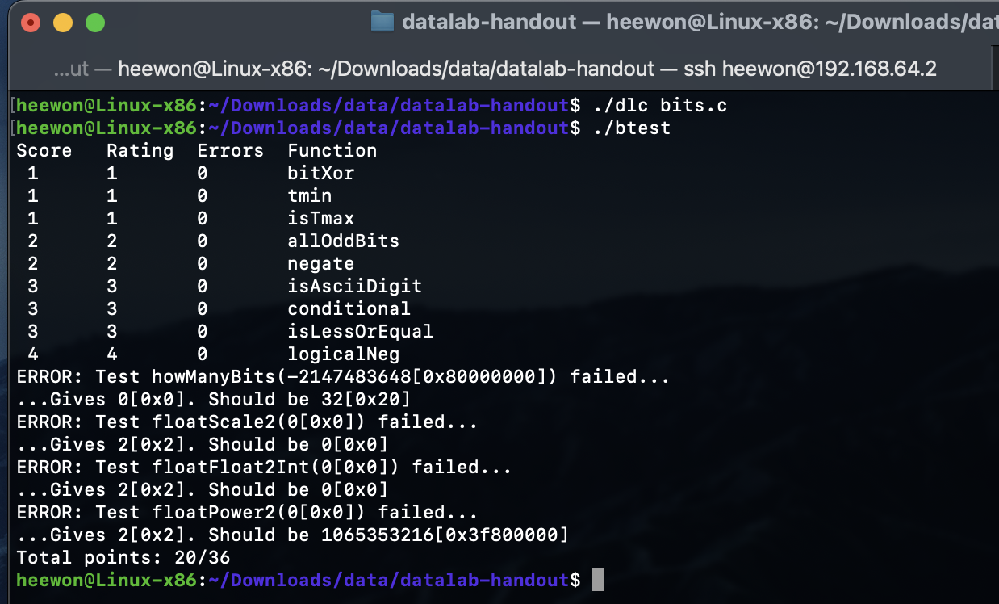

# CS 스터디 2주차

### Data Lab

CSAPP Data Lab 과제이다.
비트 연산과 2의 보수 체계의 이해를 바탕으로 기본 논리 연산부터 부동소수점 처리까지 다양한 연산을 구현하는 과제이다.

```C
/* 
 * bitXor - x^y using only ~ and & 
 *   Example: bitXor(4, 5) = 1
 *   Legal ops: ~ &
 *   Max ops: 14
 *   Rating: 1
 */
int bitXor(int x, int y) {
  return ~(~(x&~y)&~(~x&y));
}
```
XOR 연산자는 두 비트가 서로 다를 때 1을 반환하는 연산으로, 기본적으로 `(x & ~y) | (~x & y)`로 표현할 수 있다.
본 구현은 | 연산자의 사용이 제한되어 있어, 드모르간의 법칙을 활용하여 `~(~(x & ~y) & ~(~x & y))`와 같이 변환함으로써 동일한 결과를 도출하였다.
<br>

```C
/* 
 * tmin - return minimum two's complement integer 
 *   Legal ops: ! ~ & ^ | + << >>
 *   Max ops: 4
 *   Rating: 1
 */
int tmin(void) {
  return (1<<31);
}
```
2의 보수 체계에서 표현 가능한 최소 정수 $Tmin$ 은 최상위 비트가 1이고 나머지 비트가 0인 형태, 즉 `0x80000000`이다. 이는 정수 1을 31비트 왼쪽으로 이동시키는 연산을 통해 생성할 수 있다.
<br>

```C
/*
 * isTmax - returns 1 if x is the maximum, two's complement number,
 *     and 0 otherwise 
 *   Legal ops: ! ~ & ^ | +
 *   Max ops: 10
 *   Rating: 1
 */
int isTmax(int x) {
  int plus_one_gives_bitwise_inverse=!((x+1)^(~x));
  int not_minus_one=~x;
  //We have to return a boolean value so
  //use the fact that a&b==!((!a)|(!b))
  return !((!plus_one_gives_bitwise_inverse)|(!not_minus_one));
}
```
2의 보수 체계에서의 최대값 $Tmax$는 `x + 1 == ~x`라는 성질을 가진다. 그러나 $-1$ 역시 동일한 성질을 가지므로, 이를 구분하기 위해 `x != -1` 조건이 함께 필요하다. 이 함수는 두 조건을 조합하여 `x`가 $Tmax$인지 여부를 판별한다.
<br>

```C
/* 
 * allOddBits - return 1 if all odd-numbered bits in word set to 1
 *   where bits are numbered from 0 (least significant) to 31 (most significant)
 *   Examples allOddBits(0xFFFFFFFD) = 0, allOddBits(0xAAAAAAAA) = 1
 *   Legal ops: ! ~ & ^ | + << >>
 *   Max ops: 12
 *   Rating: 2
 */
int allOddBits(int x) {
  //all odd bits : 0b10101010=170
  int all_odd_mask=170+(170<<8)+(170<<16)+(170<<24);
  int turn_off_even_bits=x&all_odd_mask;
  int check_odd_bits=!(turn_off_even_bits^all_odd_mask);
  return check_odd_bits;
}
```
`x`의 모든 홀수 위치 비트(1, 3, 5, …, 31번 비트)가 1인지 확인하는 함수이다. `all_odd_mask` 마스크는 홀수 위치 비트만 1로 설정된 값이며, `x`와 AND 연산을 수행한 결과가 이 마스크와 일치하는지 여부를 통해 판별한다.
<br>

```C
/* 
 * negate - return -x 
 *   Example: negate(1) = -1.
 *   Legal ops: ! ~ & ^ | + << >>
 *   Max ops: 5
 *   Rating: 2
 */
int negate(int x) {
  return (~x+1);
}
```
2의 보수 체계에서 어떤 정수의 부호를 반전시키는 공식은 `~x + 1`이다. 본 구현은 해당 공식을 그대로 적용하여 `x`의 음수값을 반환한다.
<br>

```C
/* 
 * isAsciiDigit - return 1 if 0x30 <= x <= 0x39 (ASCII codes for characters '0' to '9')
 *   Example: isAsciiDigit(0x35) = 1.
 *            isAsciiDigit(0x3a) = 0.
 *            isAsciiDigit(0x05) = 0.
 *   Legal ops: ! ~ & ^ | + << >>
 *   Max ops: 15
 *   Rating: 3
 */
int isAsciiDigit(int x) {
  //Checking weather it is between
  //0b00110000 and 0b00111001
  //First  : is x 0b00110***?
  int chk_first=!((x>>3)^6);
  //Second : is x 0b0011100*?
  int chk_second=!((x>>1)^28);
  return chk_first|chk_second;
}
```
ASCII 코드에서 문자 '0'에서 '9'는 10진수로 48(0x30)부터 57(0x39) 사이에 해당한다.
이를 이진수 관점에서 보면 `0b00110000`부터 `0b00111001` 사이이다.
상위 비트가 동일한지 여부를 두 가지 방식(`0b00110==6`,`0b0011100==28`)으로 확인하여 숫자 범위에 속하는지를 판단한다.
<br>

```C
/* 
 * conditional - same as x ? y : z 
 *   Example: conditional(2,4,5) = 4
 *   Legal ops: ! ~ & ^ | + << >>
 *   Max ops: 16
 *   Rating: 3
 */
int conditional(int x, int y, int z) {
  //use of illegal operator - : int all_bits_one=-1;
  int all_bits_one=(~0);
  //mask : all bits one if true, all bits zero if false
  int mask=!(x)+all_bits_one;
  return (y&mask)|(z&~mask);
}
```
삼항 연산자 `x ? y : z`를 모방한 함수이다.
`x`가 0이 아닌 경우 `y`, 0인 경우 `z`를 반환해야 하므로, `x`를 논리값으로 변환한 후 -1 (모든 비트가 1) 혹은 0 (모든 비트가 0, `-1+1`) 형태의 마스크로 치환하여 `y`와 `z` 중 선택적으로 반환한다.
<br>

```C
/* 
 * isLessOrEqual - if x <= y  then return 1, else return 0 
 *   Example: isLessOrEqual(4,5) = 1.
 *   Legal ops: ! ~ & ^ | + << >>
 *   Max ops: 24
 *   Rating: 3
 */
int isLessOrEqual(int x, int y) {
  //We need to determine wether y-x>=0 or y-x<0
  //However there is a possibility of overflowing when signs of y and x is different
  int is_same_sign=!((x^y)>>31);
  //should always return true if y is positive and x is negative and vice versa
  int y_pos_x_neg=(!is_same_sign)&(!(y>>31));
  //Check the sign of y-x if two signs are smae
  //use of illegal operator - : y-x
  int is_positive=!((y+~x+1)>>31);
  return y_pos_x_neg|(is_same_sign&is_positive);
}
```
`x <= y` 관계를 비교 연산 없이 구현한 함수이다.
`x`와 `y`의 부호가 같은 경우, `y - x`연산 시 Overflow가 발생할 수 있으므로, 우선 `x`와 `y`의 부호가 같은지 확인한 후, 부호가 다를 경우 `x`가 음수이고 `y`가 양수인지를 판별하여 그 자체로 결과를 반환한다.
부호가 같을 경우 `y - x` 연산의 부호를 확인함으로써 비교 결과를 구한다.
<br>

```C
/* 
 * logicalNeg - implement the ! operator, using all of 
 *              the legal operators except !
 *   Examples: logicalNeg(3) = 0, logicalNeg(0) = 1
 *   Legal ops: ~ & ^ | + << >>
 *   Max ops: 12
 *   Rating: 4 
 */
int logicalNeg(int x) {
  //Only 0 has positive sign for both x and -x
  return ((x|(~x+1))>>31)+1;
}
```
논리 부정 연산자 `!x`와 동일한 기능을 구현한 함수이다.
`x`가 0일 경우에만 `x`와 `-x` 모두 양수(즉, 최상위 비트가 0)이다.
이러한 특성을 이용하여 `x`와 `-x`의 OR 연산 결과의 최상위 비트를 확인하고, 그 결과에 1을 더함으로써 `x == 0`일 때만 1을 반환하도록 설계하였다.
<br>



`dlc`로 코드에 위반사항이 없는지 확인할 수 있고, `btest`로 채점을 할 수 있다.

뒤에 있는 함수들은 어렵기도 하고, 스터디에서 부동소수점 실수는 다루지 않았으니까 다음기회에.....
